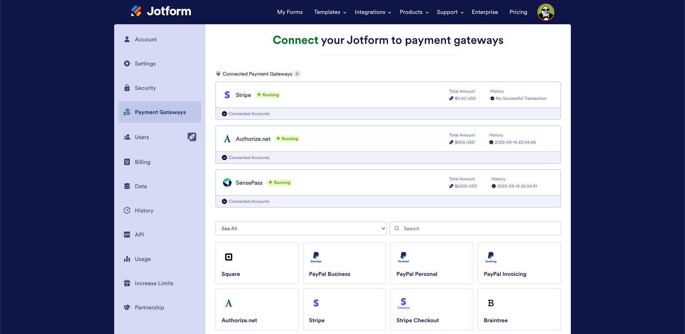
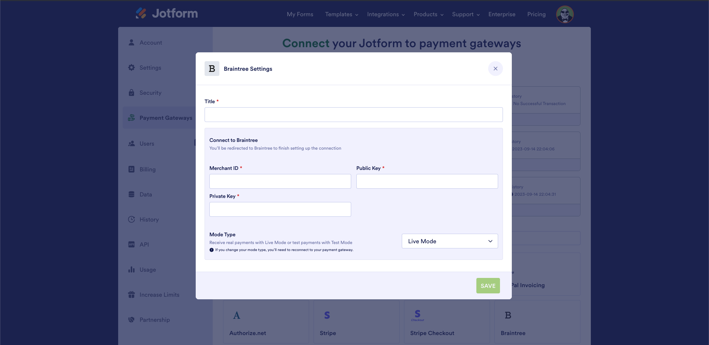
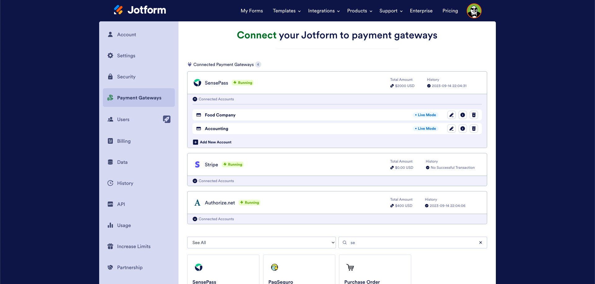
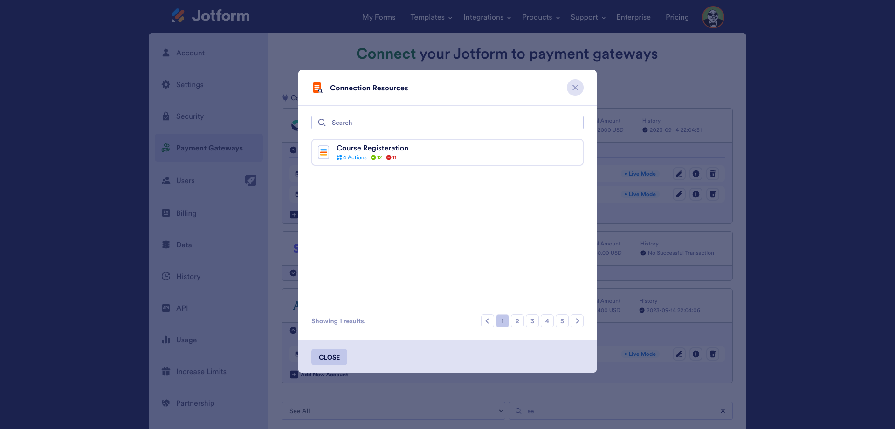
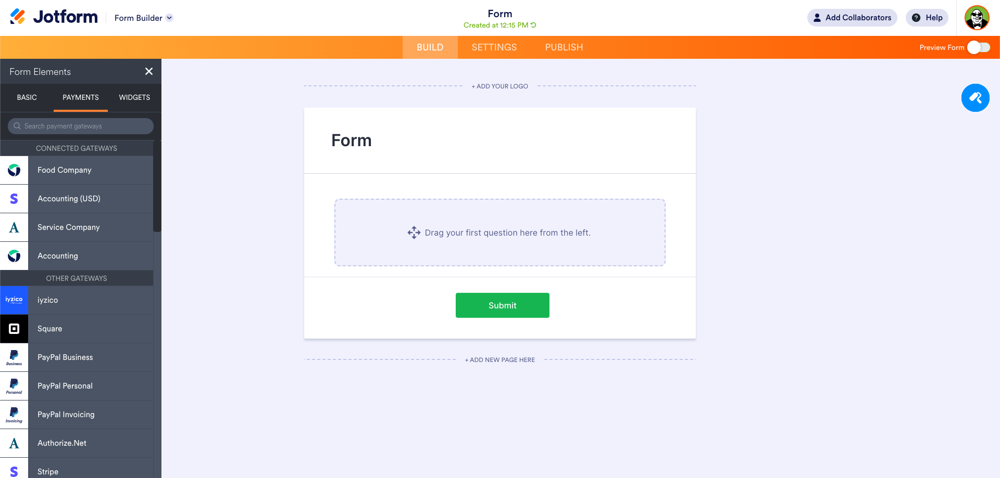
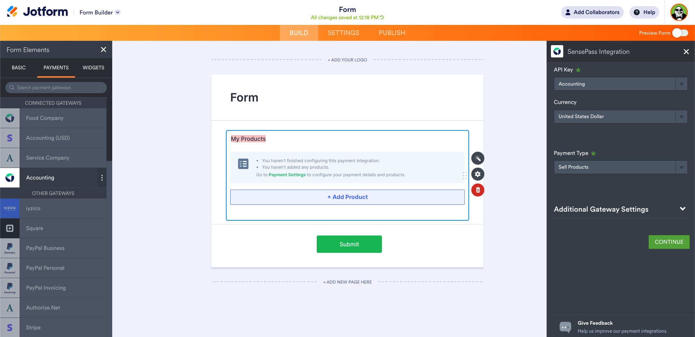
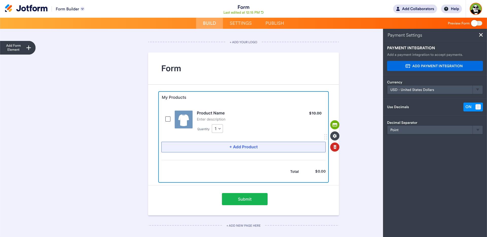
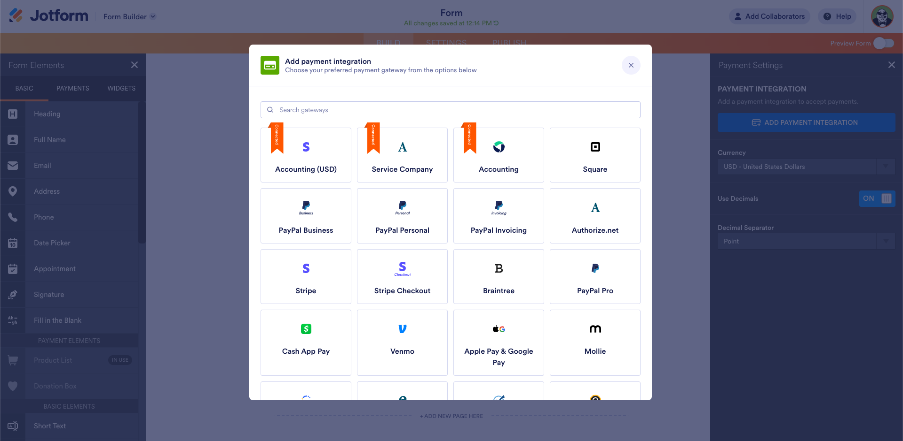
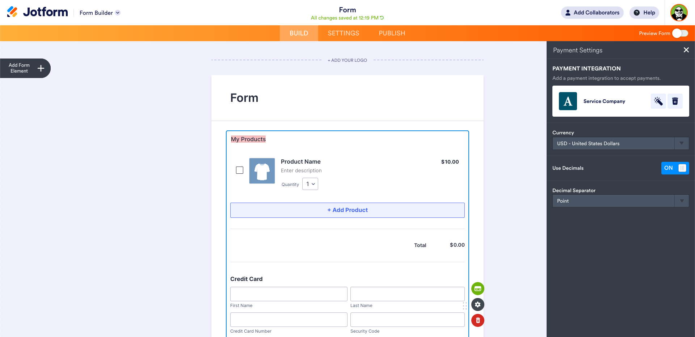

> # **Reausable Connetions by Junior Payment Products**

In this project, we have addressed the issue of users having to enter their payment methods separately for each form on Jotform. We've introduced a solution where users can securely save their payment methods in their personal profiles. This innovation brings several significant benefits:

Time Saving: Users no longer need to repeatedly input the same payment information for each form, resulting in time savings. The requirement to re-enter payment details for each form is eliminated.

Efficiency and Convenience: Payment information is securely stored in users' personal profiles, allowing them to access it whenever they need. This enables users to easily and quickly use their preferred payment method in any form they fill out.

Security Enhancement: By centralizing payment method information in user profiles, we've enhanced security. Users can trust that their sensitive financial data is protected within their profiles, reducing the risk associated with entering payment details repeatedly.

Management Simplification: Updating or changing payment information is now a straightforward process, as it only needs to be done once in the user profile. Managing multiple forms with different payment methods is no longer complex and time-consuming.

Overall, the primary goal of this innovation is to improve the user experience by making online transactions more efficient, secure, and convenient. Additionally, it streamlines business processes and significantly benefits both users and the platform.

> NOTE: I am not able to share frontend and backend codes due to confidentiality agreements.

> ## **Technologies and techniques used in the project**

### **Frontend**

- **React**
- **Tailwind CSS**
- **Axios**
- **Redux**
- **Redux-Saga**

### **Backend**

- **PHP**

### **Database**

- **MySQL**

> ## **Contributors**

[Mustafa HINCAL](https://github.com/mustafahincal)

[Oguzhan DENIZ](https://github.com/oguzhandeniz)
